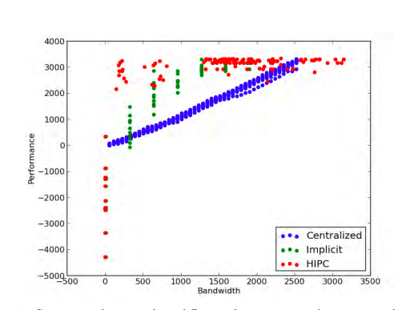
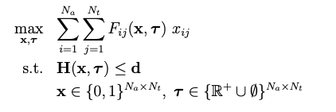

> **Reading notes from the following paper:** https://apps.dtic.mil/dtic/tr/fulltext/u2/a627417.pdf


## Criteria's to evaluate a task allocation algorithm

1. Offline or Online algorithm
2. Policy based or off-policy based
3. Centralized or decentralized
4. Time complexity of algorithm

### Envrionments Charachterstics:

1. Dynamic or Static
2. Network strength
3. Time criticalness of the situation.

### An ideal centralized environment requires 

1. agent objective knowledge is available at a centralized location 
2. communication channels from the
centralized location to each agent, and 
3. full information state knowledge at the centralized
location.

### For ideal decentralized behavior, two conditions must be met:

1. Agent decisions cannot conflict with other
agents, and 
2. the relevant agent information state must be locally observable.

```
The design criteria for creating the best algorithms for a given environment becomes, what information is communicated to whom, where is the computation done, and what is computed. The goal is then to design algorithms that can answer these questions during runtime for the realized mission and environment. The answers to these questions have led to the ideas in the Hybrid Information and Plan Consensus algorithm (HIPC).
```



### GICA and LICA.

Thus, advanced communication protocols are typically required for decentralized algorithms to optimize over desired objectives.

These communication protocols can be categorized into two main information assumptions:

1. global information consistency assumptions. 
2. local information consistency assumptions.

Wheather to choose GICA or LICA decision variables:
1. The mission complexity.
2. communication environment.
3. time constraints for creating assisgments.


```
Network disconnections during global information consistency algorithms will break the assumptions tied to performance and sometimes convergence. Possible repairs would include waiting until the network reconnect (may never happen) or detecting the new network, continuing on and hoping that future network dynamics wont break the resulting allocation (which is not a guarantee). This domain is handled naturally with local consistency assumptions which can ensure provably good performance in contested communication environments.
```

This lack of assignment guarantee can lead to instability in the convergence process. Specifically, if the agent objective functions do not obey a
property called submodularity, algorithms that only require LICA may not converge.


##### Some objective functions that are **non-submodular**:
1. Fuel penalties
2. information gathering metrics.
3. cooperative tasking metrics
4. stochastic objectives
   
#### Problem Formulation



x is the set of binary decision variable set, where $x_{ij}$ tells whether the task j is assigned to agent i.
$t_{ij}$ is the time required to that task.

H is set of $N_c$ non linear constraints along with d set. 

>This problem formulation can accommodate
most design objectives and constraints used in multi-agent decision making problems (e.g.
search and surveillance missions where Fij represents the value of acquired information and
the constraints hk capture fuel limitations and/or no-fly zones, or rescue operations where Fij
is time-critical favoring earlier τij execution times, etc).

The algorithms used in this work solve distributed greedy multi-agent multi-assignment
problems. For each agent, these problems take a similar form to Equation (1), except
individual agents independently create assignments for themselves, and then iterate with
others using a consensus algorithm to produce a final team-wide assignment. The details of
this process will be explored throughout the rest of this report.

#### Submodularity

For the purposes of this paper, submodularity can be defined as follows: the marginal score function F(S|A) for incrementing an allocation by a set S to an existing task allocation A, must satisfy the following 


```
Submodular score functions are essential for LICA algorithms to guarantee convergence.
```
**Important**

> This paper presents an online process to modify a LICA
algorithm called the consensus based bundle algorithm (CBBA) that enables the use of non-submodular score functions while still guaranteeing convergence. The principles of the approach are quite general and could be applied to many LICA algorithms.

> **Question to ask to professor** 
> Please explain why LICA won't work with non-submodular score functions.

Submodularity means, a set function representing natural marginal diminishing returns property.
as we keep adding values to set, the difference of original value and new value of function decreases as size of the set increases.